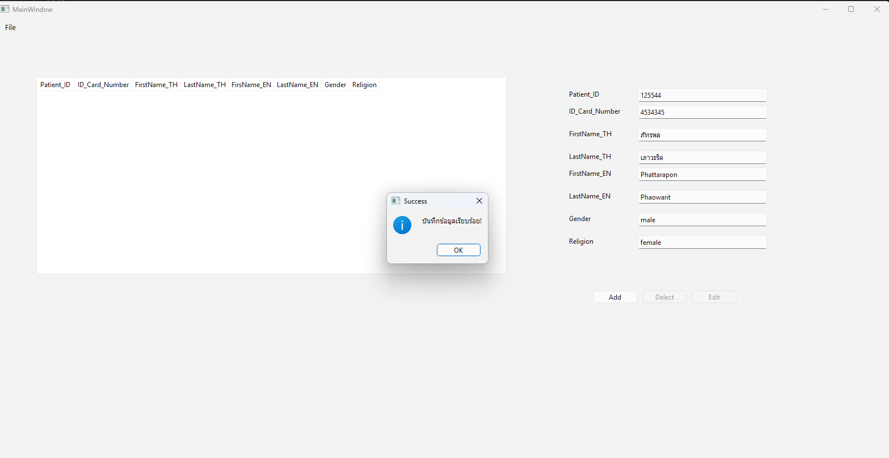
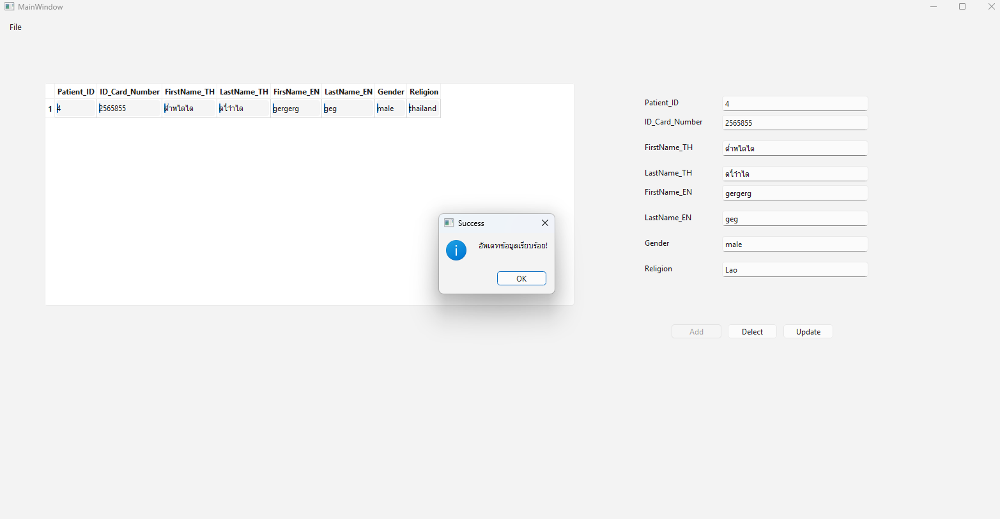
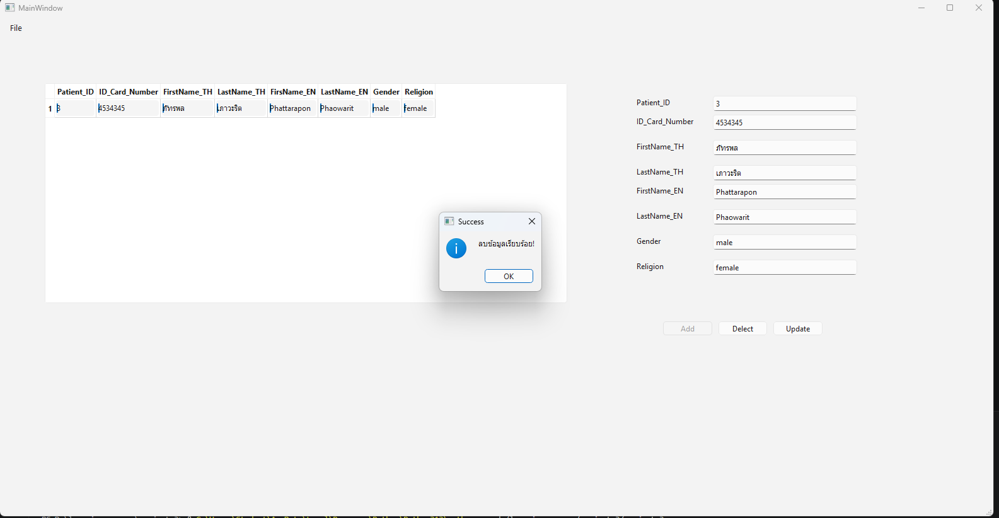

# ระบบจัดการข้อมูลผู้ป่วย

ระบบบันทึกข้อมูลผู้ป่วย รองรับการเพิ่ม แก้ไข ลบ และแสดงข้อมูลผ่านตาราง


## ความสามารถ

- ✅ เพิ่มข้อมูลผู้ป่วยใหม่
- ✅ แก้ไขข้อมูลผู้ป่วย
- ✅ ลบข้อมูลผู้ป่วย
- ✅ แสดงรายการผู้ป่วยในตาราง

## ภาพตัวอย่างการใช้งาน

# ต้องกด ok ข้อมูลจึงจะอัพเดต


### เพิ่มข้อมูล


### แก้ไขข้อมูล


# ต้องกด ok ข้อมูลจึงจะอัพเดต

### ลบข้อมูล


## วิธีติดตั้ง

```bash
pip install PySide6
python main.py
